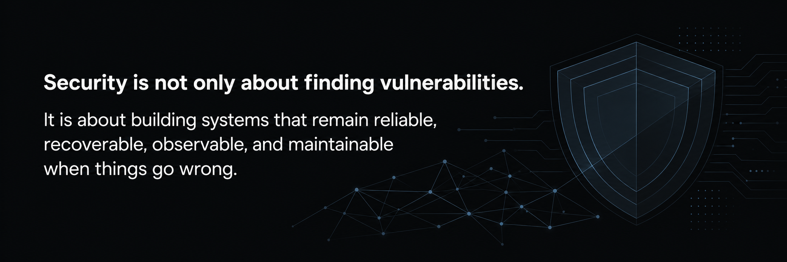

## About

---

I work on secure software delivery, architecture, and operations for custom business systems, with a focus on Laravel application security, API security, observability, and operational resilience.

I currently support Bitflow in preparing its platforms, processes, and technical evidence to strengthen data protection, cybersecurity, observability, incident response, and recovery capabilities.

---

## Security Focus

**Development & Code**
- Application Security · API Security · Secure SDLC
- Security Code Review · Vulnerability Management · OWASP ZAP Testing

**Operations & Resilience**
- Security Observability · Incident Response
- Backup Verification · Disaster Recovery · Operational Runbooks

**Governance & Access**
- Access Control · Secrets Management
- Data Protection

---

## Security Frameworks

| Standard | Version |
|---|---|
| CIS Controls | v8 — Implementation Group 1 |
| NIST CSF | 2.0 |
| OWASP ASVS | 5.0 |
| OWASP API Security | Top 10 |

---

  

